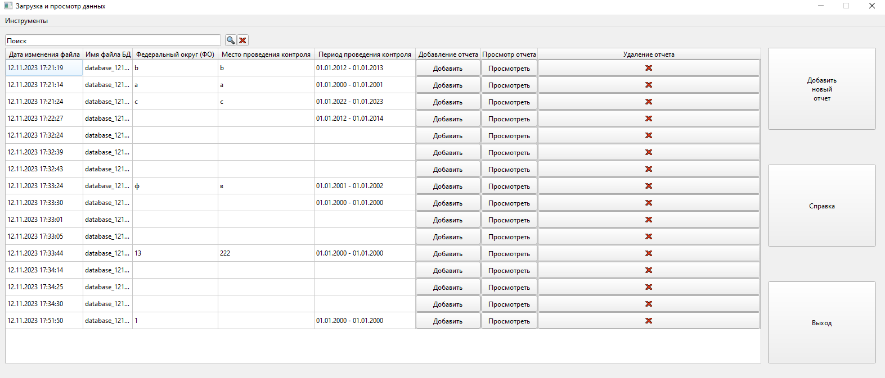
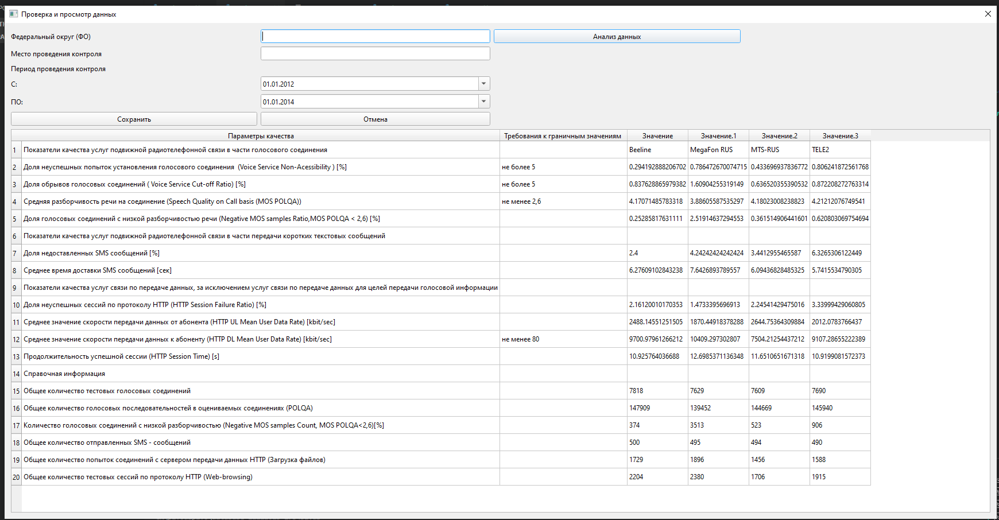
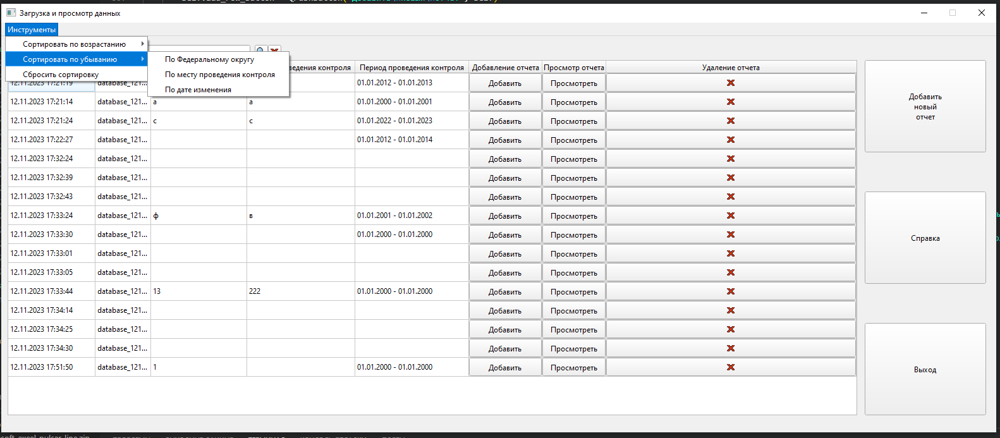
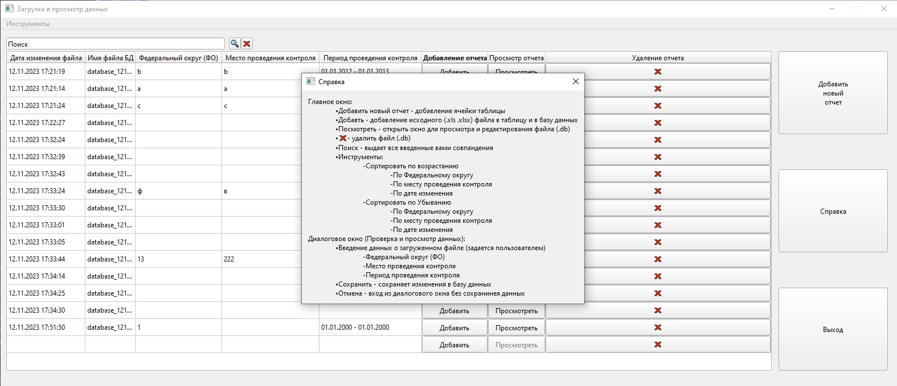

# Хакатон связи 2023

### 1 Цель кейса

1.1 Наименование специального программного обеспечения
Специальное программное обеспечение предназначено для
автоматизации процесса ввода результатов измерений в базу данных (далее –
БД).

Рабочее название проекта – «СПО РКОТ».

1.2 Назначение СПО
СПО РКОТ предназначено для автоматизации процесса конвертации
итоговых результатов измерений РКОТ из XLS-файла в формат БД.

1.3 Цели создания
Обеспечение процесса ввода результатов измерений РКОТ из XLSфайла в БД для их учета и последующей аналитической обработки.
Основными задачами разработки СПО РКОТ являются:

- разработка СПО для преобразования данных результатов
измерений (протокола) РКОТ и их конвертация к унифицированному
формату;

- разработка клиента (интерфейса) для просмотра и
редактирования результатов преобразованных данных СПО РКОТ.

### 2 Исходные данные:

Унифицированный формат протокола РКОТ (XLS-файл) для измерений.
Преобразованию данных подлежит заполненный XLS-файл «Protocol» 

### 3 Работа программы

- Главное окно: 

- Диалоговое окно (Просмотр, редактирование):

- Инструменты: 

- Справка: 

